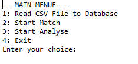
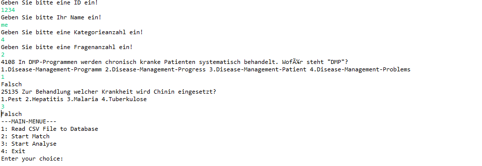
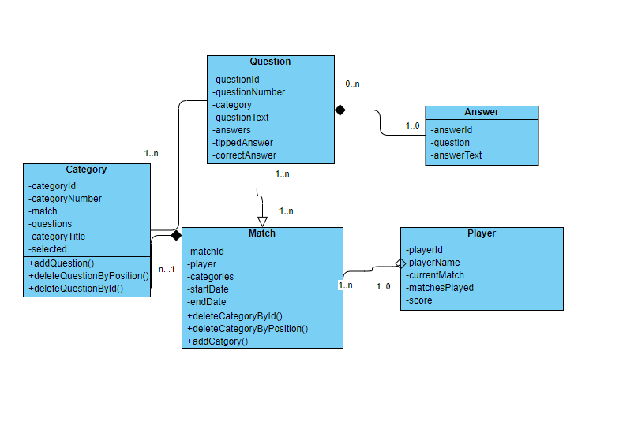
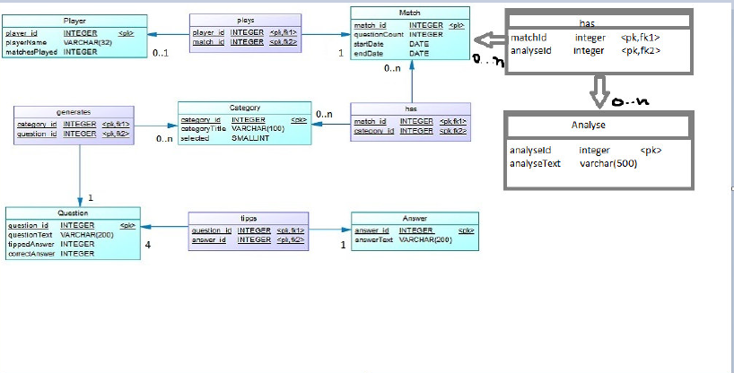

# Quiz

## Table of Contents
1. [General Info](#general-info) 
 - [User Story](#user-story)
3. [Technologies](#technologies)
4. [Installation](#installation)
5. [Collaboration](#collaboration)
6. [FAQs](#faqs)

### General Info
***
The aim of the project is to develop a game with which you can use your knowledge in various
Can test areas of knowledge (categories).

### User Story
***

  
User Story
 

1. The program is executed. A menu will appear with the following options
displayed: load a csv file, start the game, perform an analysis. :white_check_mark:

1.1 If the player wants to load a new file, the csv file is read and a message issued whether the file was successfully read. If the file succeeds
a database connection will take place. If the database connection could not be established, an error message is displayed. If the
The database connection has been successfully carried out, the databases are updated and the main menu with the three options is displayed. :white_check_mark:

1.2 If the player wants to start the game directly, the game is started. :white_check_mark:

1.2.1 The player is asked to enter his name and an ID number. Then the Players are asked to select at least two categories and number of questions. After input from the player generates questions. Each question has four possible answers. The player is asked to enter the number of an answer. There will be a message displayed whether the answer was correct or incorrect. After the last question, the main menu appears issued with the three options. :white_check_mark:

1.3 If the player wants to carry out an analysis, an analysis is carried out. (incomplete) :red_circle:

1.3.1 After entering “y” you will be asked for two IDs and the analysis will start. The ID of the player who has more correct answers is output. The game will
completed.

1.3.2 After entering “n” the game ends.
  

### Class diagram and relations⚠️ :warning: (incomplete)

## Technologies
***
A list of technologies used within the project:
* [JPA](https://www.logicbig.com/tutorials/java-ee-tutorial/jpa/jpa-primary-key.html)
* [AttributeConverter](https://docs.oracle.com/javaee/7/api/javax/persistence/AttributeConverter.html)
* [Hibernate Eclipse](https://hibernate.org/community/contribute/eclipse-ide/)
* [Hibernate Gradle Example](https://examples.javacodegeeks.com/enterprise-java/hibernate/hibernate-gradle-example/)
* [Eclipse](https://wiki.eclipse.org/EGit/User_Guide#Committing_Changes)
* [MySql](https://www.java-success.com/13-%e2%99%a6-getting-started-mysql-beginner-tutorial/)
* [GitKraken](https://www.gitkraken.com/)
* [EclipseLink](https://www.eclipse.org/eclipselink/)
* [Persistence Unit](https://www.objectdb.com/java/jpa/entity/persistence-unit)
*  [JRE 1.8.2]
*  [JDK 13.0.2]
*  [Annotation Example](https://www.baeldung.com/jpa-joincolumn-vs-mappedby)

## Installation
***
A little intro about the installation. 

The repository does not contain a complete project.
Content of the repository:
- persistence.xml file
- java classes
- readme file
- csv file with sample questions and answers

## Collaboration
***

> This project was one of my internships provided by the Darmstadt University of Applied Sciences. Advice on how to proceed in this project was received from the Damrstadt University of Applied Sciences.

## FAQs
...
